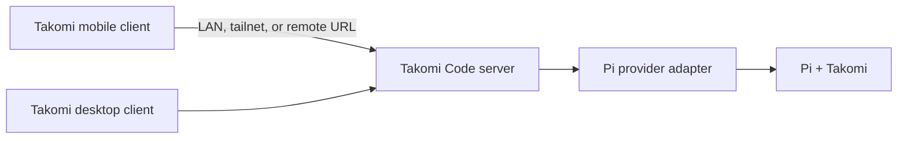

# Takomi Code desktop and Android builds

## Overview

The current fork can be built as a separately identified Windows desktop application and as an Android remote client. The desktop/server host runs Pi and Takomi. Android connects to that host; Pi does not run on the phone.



## Desktop identity

The desktop fork was separated from an installed upstream T3 Code application.

| Identity                  | Takomi value                 |
| ------------------------- | ---------------------------- |
| Product name              | `Takomi Code (Alpha)`        |
| Application ID            | `com.jstarfilms.takomicode`  |
| Production protocol       | `takomi-code://`             |
| Development protocol      | `takomi-code-dev://`         |
| Installer prefix          | `Takomi-Code-`               |
| Runtime data root         | `%USERPROFILE%\.takomi-code` |
| Electron user data        | `%APPDATA%\takomi-code`      |
| Development Electron data | `%APPDATA%\takomi-code-dev`  |

Internal workspace names and compatibility environment variables such as `@t3tools/*` and `T3CODE_HOME` remain unchanged intentionally.

Primary identity files:

- `apps/desktop/package.json`
- `apps/desktop/src/app/DesktopEnvironment.ts`
- `apps/desktop/src/electron/ElectronProtocol.ts`
- `apps/desktop/scripts/electron-launcher.mjs`
- `scripts/build-desktop-artifact.ts`
- `scripts/dev-runner.ts`
- `apps/web/src/branding.ts`
- `apps/web/index.html`

Desktop, web, and mobile now use the shared Takomi cyan/purple icon sourced from `assets/takomi/takomi-icon-1024.png`. Derived web favicons, Windows ICO, Electron runtime resources, and checked-in Android launcher resources are kept alongside their platform targets. `scripts/lib/brand-assets.ts` maps development, preview/nightly, and production channels to the Takomi icon while retaining channel-specific display-name suffixes.

## Windows Electron runtime repair

`apps/desktop/scripts/ensure-electron-runtime.mjs` originally required `python3` to extract Electron archives on Windows. The Windows path now uses PowerShell `Expand-Archive`, while macOS continues to use `ditto` and other Unix platforms retain the Python path.

This fixed:

```text
Python was not found
python3 ... ZipFile(...).extractall(...) failed with exit code 9009
```

## Desktop development

From the repository root:

```powershell
pnpm dev:desktop
```

The dev runner selects available ports dynamically. Use the printed URLs rather than assuming port `3773`.

The Takomi fork defaults to:

```text
%USERPROFILE%\.takomi-code
```

instead of sharing upstream T3's data root.

## Windows installer

Build x64 NSIS:

```powershell
pnpm dist:desktop:win:x64
```

Validated output:

```text
release\Takomi-Code-0.0.34-x64.exe
release\Takomi-Code-0.0.34-x64.exe.blockmap
```

The validated executable metadata was:

```text
ProductName: Takomi Code (Alpha)
FileDescription: Takomi Code desktop build
CompanyName: JStaRFilms
FileVersion: 0.0.34
```

The local installer is unsigned and may trigger Windows SmartScreen.

The packaging command may warn that no WSL `node-pty` prebuild was provided. That warning means the packaged WSL backend will not start; the normal Windows backend still works.

## Desktop verification history

Validated during the rebrand/fix:

- Electron 41.5.0 runtime extraction
- real `pnpm dev:desktop` startup
- desktop, web, and scripts typechecks
- desktop packaging tests
- Electron protocol tests
- desktop window tests
- Windows x64 NSIS build

A full desktop suite run also exposed unrelated Windows path-fixture assertions that compare POSIX fixture paths to native Windows paths. These should be repaired separately; they were not caused by the Takomi identity work.

## Android architecture

`apps/mobile` is an Expo/React Native application with custom native modules. Expo Go is not supported.

The Android application is only a client:

- it connects to a Takomi Code server over LAN, Tailscale, or another reachable endpoint
- it uses the server's provider snapshot and model list
- Pi and Takomi execute on the server/desktop machine
- question requests and provider runtime events travel through the shared T3 contracts

## Current mobile branding state

Visible application names are now:

```text
Development: Takomi Code Dev
Preview:     Takomi Code Preview
Production:  Takomi Code
```

The Expo configuration, in-app `BrandMark`, authentication client label, notification copy, widget description, web favicon source, and checked-in Android application label use Takomi branding. Mobile, web, and desktop share the Takomi cyan/purple icon.

Distribution identity is deliberately unchanged in this pass. `apps/mobile/app.config.ts` still contains upstream-compatible package IDs, schemes, Expo/EAS project/update values, and Clerk relying-party configuration. These are internal compatibility/infrastructure identifiers rather than visible names, but they must be migrated to Takomi-owned services before public distribution.

## Debug client versus standalone APK

Two Android build types were produced during validation:

### Development client

A debug APK built by:

```powershell
pnpm exec expo run:android
```

This APK expects Metro and displays instructions such as `npx expo start`. It is not independent.

### Standalone release

A release APK built with Gradle embeds `assets/index.android.bundle` and does not require Metro or Expo after installation.

Validated APK:

```text
release\Takomi-Code-Standalone-1.0.2.apk
```

Validated properties:

```text
Package: com.t3tools.t3code.dev
Application label: Takomi Code Dev
Architecture: arm64-v8a
Embedded JavaScript bundle: assets/index.android.bundle
Approximate size: 91 MB
```

This APK uses the generated debug signing key for local testing. It is not suitable for Play Store distribution.

## Windows native-build path workaround

React Native's CMake/Ninja build exceeded Windows object-path limits in the normal repository path. A `subst` drive did not work because pnpm dependency junctions resolved back to `C:`, causing mixed-root codegen failures.

The validated layout is:

```text
C:\ta    short detached Git worktree
C:\tp    pnpm virtual store
```

The short worktree is registered from the main clone. The temporary worktree's `pnpm-workspace.yaml` is amended with:

```yaml
virtualStoreDir: C:/tp
virtualStoreDirMaxLength: 32
```

These settings are build-worktree-only and are not part of the main repository configuration.

Why both paths matter:

- `C:\ta` shortens generated Android and CMake paths
- `C:\tp` removes long `node_modules\.pnpm\...` prefixes from native package source paths
- keeping everything on `C:` prevents React Native codegen's “different roots” error

## Standalone Android build procedure

The machine-local helper is:

```text
%USERPROFILE%\Desktop\Build Takomi Android Standalone.cmd
%USERPROFILE%\Desktop\Build-Takomi-Android-Standalone.ps1
```

It:

1. creates or updates `C:\ta`
2. configures the short `C:\tp` virtual store
3. installs dependencies when the lockfile/layout changes
4. runs a clean Expo Android prebuild when needed
5. writes `android/local.properties`
6. builds `app:assembleRelease` for `arm64-v8a`
7. copies the standalone APK to the repository's `release` directory

Manual core build command from the generated Android project:

```powershell
cd C:\ta\apps\mobile\android
$env:APP_VARIANT = "development"
$env:NODE_ENV = "production"
.\gradlew.bat app:assembleRelease `
  -x lint `
  -x test `
  --configure-on-demand `
  --build-cache `
  -PreactNativeArchitectures=arm64-v8a
```

Output:

```text
C:\ta\apps\mobile\android\app\build\outputs\apk\release\app-release.apk
```

## Android troubleshooting history

### Android SDK not found

Failure:

```text
SDK location not found
```

Local SDK:

```text
C:\Users\johno\AppData\Local\Android\Sdk
```

Generated `android/local.properties`:

```properties
sdk.dir=C:/Users/johno/AppData/Local/Android/Sdk
```

### CMake object paths too long

Failure:

```text
ninja: error: manifest 'build.ninja' still dirty after 100 tries
```

Resolution: use both `C:\ta` and the `C:\tp` pnpm virtual store.

### Mixed drive roots

Failure after using `subst T:`:

```text
this and base files have different roots: T:\... and C:\...
```

Resolution: use a real short worktree on `C:` rather than a substituted drive.

### App asks for Expo

Cause: the debug development-client APK was installed.

Resolution: uninstall/replace it with `Takomi-Code-Standalone-1.0.2.apk`, which contains the embedded JavaScript bundle.

## Next distribution work

Before distributing the Android app publicly:

- migrate package IDs to `com.jstarfilms.takomicode` with separate dev/preview IDs
- migrate URL schemes to Takomi-owned values
- create a new Expo owner/project ID
- replace or disable the upstream EAS update URL
- configure Takomi-owned Clerk/OAuth values, or define a local-only path
- create a private release keystore and protect its credentials
- test pairing, Pi provider selection, questions, images, tools, and interruption on device
