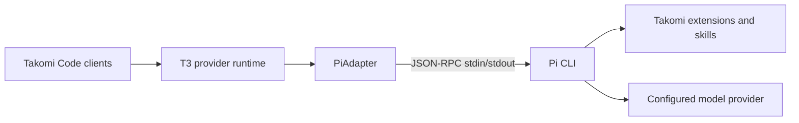

# Takomi / Pi provider

## Overview

Takomi is integrated into Takomi Code as a first-party T3 provider backed by the Pi CLI. Pi owns the model session, tool loop, extensions, context, and persistent JSONL session. Takomi Code owns the desktop/web/mobile clients, projects, attachments, work log, provider-neutral runtime, and remote connection layer.

This is structured JSON-RPC integration, not terminal scraping.



## Architecture

- **Driver:** `apps/server/src/provider/Drivers/PiDriver.ts`
- **Provider snapshot and health probe:** `apps/server/src/provider/Layers/PiProvider.ts`
- **JSON-RPC process adapter:** `apps/server/src/provider/Layers/PiAdapter.ts`
- **Driver registration:** `apps/server/src/provider/builtInDrivers.ts`
- **Settings contracts:** `packages/contracts/src/settings.ts`
- **Runtime event contracts:** `packages/contracts/src/providerRuntime.ts`
- **Web metadata:** `apps/web/src/components/settings/providerDriverMeta.ts`
- **Web icon mapping:** `apps/web/src/components/chat/providerIconUtils.ts`
- **Session logic:** `apps/web/src/session-logic.ts`

The provider driver kind is `pi`; its display name is `Takomi (Pi)`.

## Data flow

### Starting a session

1. T3 starts the Pi process in RPC mode.
2. The adapter optionally passes a persisted Pi session file for resumption.
3. The adapter requests Pi state with `get_state`.
4. Startup does not settle until Pi reports a valid persistent session file.
5. The Pi session file becomes T3's provider resume cursor.

Waiting for `get_state` prevents a server restart from creating a duplicate Pi session before the resume cursor is known.

### Sending a turn

1. T3 sends the user's text and attachment metadata to `PiAdapter`.
2. Image attachments are persisted and encoded as Pi image content.
3. Pi runs the selected model and Takomi tools.
4. Pi emits structured text, reasoning, tool, UI, compaction, and lifecycle events.
5. `PiAdapter` translates them into canonical T3 provider runtime events.

### Interrupting

T3 sends Pi's abort command and then terminates the RPC process after settlement. Process termination is intentional: Pi's abort acknowledgement can precede late tool events, so stopping the process is the reliable boundary that prevents interrupted work from continuing. The next turn resumes from the persisted session file.

## Supported behavior

- streaming assistant text
- streaming reasoning
- tool start, update, completion, and failure events
- image attachments
- extension notifications
- extension confirmations
- extension select/input/editor requests
- native T3 user-input and approval responses back to Pi
- context compaction events
- model switching inside a session
- interruption
- process cleanup
- persistent Pi session resumption
- custom Pi provider instances and models
- live discovery of Pi's configured models and model-specific thinking levels

## Question and extension UI bridge

Pi `extension_ui_request` messages are mapped as follows:

| Pi method | T3 event/UI                  | Response to Pi                    |
| --------- | ---------------------------- | --------------------------------- |
| `select`  | `user-input.requested`       | `extension_ui_response.value`     |
| `input`   | `user-input.requested`       | `extension_ui_response.value`     |
| `editor`  | `user-input.requested`       | `extension_ui_response.value`     |
| `confirm` | `request.opened` approval UI | `extension_ui_response.confirmed` |
| `notify`  | `runtime.warning`            | none                              |

This is why Takomi's question-asking flow appears in the existing T3 question UI. It was implemented deliberately.

Current fidelity limitations:

- the adapter emits one T3 question per Pi UI request
- option descriptions currently repeat the option label
- rich previews are not carried through
- multi-select metadata is not explicitly mapped
- unsupported Pi extension UI methods are ignored
- most Takomi tools use generic T3 tool cards rather than custom components

## Tool presentation

Pi emits `tool_execution_start`, `tool_execution_update`, and `tool_execution_end`. The adapter turns these into T3 runtime items and classifies common file, shell, search, MCP, subagent, and dynamic tool names.

Tools such as Takomi boards, todos, and subagents run inside Pi. Unless a dedicated T3 component exists, their structured arguments/results appear in generic work-log cards.

## Configuration

Recommended normal-user settings:

| Setting            | Recommended value | Description                             |
| ------------------ | ----------------- | --------------------------------------- |
| Binary path        | `pi`              | Globally installed Pi executable        |
| Pi agent directory | blank             | Allows Pi's normal global discovery     |
| Takomi suite root  | blank             | Normal globally installed Takomi setup  |
| Launch arguments   | blank             | Extra Pi CLI arguments only when needed |

With blank overrides, Pi discovers global assets from locations such as:

```text
~/.pi/agent/settings.json
~/.pi/agent/extensions/
~/.pi/agent/prompts/
~/.pi/agent/themes/
~/.agents/skills/
```

For Takomi source development, set **Takomi suite root** to the VibeCode Protocol Suite checkout. The adapter then loads Takomi extensions and prompt templates from that checkout directly.

`Pi agent directory` sets `PI_CODING_AGENT_DIR`. Do not point it at the whole Takomi suite unless that directory is intentionally structured as a Pi agent home.

## Runtime constraints

Only T3's `full-access` runtime mode is accepted. `approval-required` and `auto-accept-edits` are rejected because T3 does not yet enforce permissions around every Pi tool invocation.

Pi extension confirmations are bridged, but that is not equivalent to complete provider-level tool permission enforcement.

## Session interoperability

A T3-created Pi session can be opened from a terminal with:

```powershell
pi -r
```

or:

```powershell
pi --session "C:\path\to\session.jsonl"
```

Do not open the same session file in terminal Pi while Takomi Code is actively writing it.

Automatic discovery/import of independently created terminal Pi sessions into Takomi Code is not implemented.

## Known limitations

- utility text generation (thread titles, branch names, commit messages, and PR text) is not implemented by the Pi driver
- only `full-access` is supported
- terminal-to-T3 Pi session import is not supported
- unknown extension UI methods are ignored
- richer question metadata is reduced to T3's current canonical shape
- Pi/Takomi slash-command discovery is not integrated into the command menu
- Takomi runtime assets are not bundled into the desktop installer; global installation or a suite root is still required

## Verification history

The implementation was validated against a real Pi/Takomi installation for:

- normal turns
- streaming and tools
- image input
- question/extension UI responses
- session persistence and restart resumption
- interruption
- model switching

Relevant implementation commits:

```text
63e3c96be feat(provider): add Pi/Takomi provider driver
f958d26da feat(web): register Pi/Takomi provider in frontend
0ae1acdc7 feat(provider): add Takomi suite support and rewrite Pi adapter
aed343097 fix(provider): fix RPC response ordering and validate session startup
```
