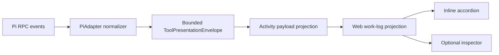

# Takomi tool-call UI

**Status:** Implemented on `Takomi-Code`

## Overview

Takomi Code presents core Takomi, TakomiFlow, Pi companion-extension, and unknown tool calls without reproducing Pi's terminal UI. Canonical inline accordions keep the conversation functional on their own, while an optional synchronized right inspector provides persistent board state and deeper subagent activity.

Desktop and browser use the same React implementation. The bounded presentation contract remains platform-neutral so mobile can consume it in a later native UI pass.

## Architecture

- **Presentation contract:** `packages/contracts/src/providerRuntime.ts`
- **Pi normalization:** `apps/server/src/provider/Layers/PiAdapter.ts`
- **Activity projection:** `apps/server/src/orchestration/ActivityPayloadProjection.ts`
- **Runtime ingestion:** `apps/server/src/orchestration/Layers/ProviderRuntimeIngestion.ts`
- **Work-log projection:** `apps/web/src/session-logic.ts`
- **Inline card:** `apps/web/src/components/chat/TakomiToolCallCard.tsx`
- **Timeline integration:** `apps/web/src/components/chat/MessagesTimeline.tsx`
- **Inspector:** `apps/web/src/components/chat/TakomiInspector.tsx`
- **Inspector state:** `apps/web/src/rightPanelStore.ts`
- **Right-panel integration:** `apps/web/src/components/ChatView.tsx`

## Presentation contract

`ToolPresentationEnvelope` is a provider-neutral, allowlisted payload containing:

- tool namespace, exact name, and renderer family;
- bounded action and status summaries;
- stable session, run, task, and child-agent identities;
- compact inline detail;
- larger inspector detail;
- bounded activity rows and artifact references;
- explicit warning/error information.

Safety limits prevent arbitrary extension results from being sent to clients:

- inline detail is capped at 600 characters;
- inspector detail is capped at 16,000 characters;
- subagent history retains at most 120 meaningful events per invocation;
- capped history is labeled as retained activity, not total activity.

Unknown tools continue through T3 Code's generic fallback.

## Inline tool cards

Inline cards are canonical: closing the inspector never removes essential information. They reuse existing T3 Code status, disclosure, typography, spacing, and work-log primitives.

Up to five inline tool accordions can remain open. Opening a sixth closes the oldest open accordion.

Renderer families cover:

| Family        | Representative tools                         |
| ------------- | -------------------------------------------- |
| Status/report | `takomi_mode`, `context_report`, diagnostics |
| Collection    | skill and policy discovery                   |
| Configuration | routing-policy preview/application           |
| Lifecycle     | `takomi_board`, `todo`, workflow state       |
| Execution     | `takomi_subagent`, TakomiFlow runs           |
| Artifact      | generated/reviewed outputs                   |

## Inspector

The right inspector is optional and synchronized with inline selections. Its primary surface is persistent Takomi Board progress, followed by invocation-first subagent activity and selected Context Detail.

### Board behavior

- board sessions merge by stable `sessionId`;
- tasks update in place with status, checklist, and notes;
- completed board state remains available after tool completion;
- selecting a board call exposes its larger detail independently of the inline card.

### Subagent behavior

Execution groups are visibly distinct:

- one synchronous child renders directly as the child agent, with no redundant wrapper, count, or dropdown;
- one detached child also renders directly and receives a compact **Async** badge;
- multiple independent children render as **Parallel run**;
- dependent children render as **Chain run**;
- multi-child detached work renders as **Async run**.

Parallel and chain groups expose expandable child rows. Children use stable `result-N` identities so selecting one filters Context Detail to only that child's prompt, thinking, tools, messages, output, and terminal status.

Activity survives partial updates and final completion. Synthetic heartbeat rows are not generated.

### Thinking traces

- main Pi `thinking_delta` events become throttled, expandable **Thinking** progress rows;
- updates for one reasoning block collapse under a stable task identity;
- remaining reasoning is flushed when the message or agent settles;
- subagent thinking content is recorded separately from ordinary assistant messages;
- traces appear only when the selected model/provider emits them.

### Scrolling

The inspector follows live activity only while the user remains near the bottom. Scrolling upward preserves position and exposes **Jump to latest** to resume following.

## Todo companion UI

The `todo` companion extension has a semantic lifecycle presentation instead of generic per-call rows:

- all create/update calls collapse into one persistent state card per thread;
- the card shows completed/total progress and overall status;
- active tasks include subject, description or active form, and status;
- deleted tasks are excluded from the active presentation.

## Pi companion extensions

When a Takomi suite root is configured, Pi still receives globally installed companion extensions. `PiAdapter` discovers package manifests from Pi settings/npm roots, explicitly loads companion extensions, and excludes duplicate global Takomi packages already supplied by the suite checkout.

This preserves tools such as `ask_user_question`, `todo`, browser/preview extensions, context-mode, and other installed Pi packages without registering Takomi tools twice.

## Stable update rules

- ordinary tool lifecycle events collapse by `toolCallId`;
- boards collapse by `sessionId`;
- Todo state collapses to one thread-level state card;
- subagent invocations merge by run/tool identity;
- child activity uses stable child and message/tool indexes;
- reasoning progress collapses only when task identities match;
- unrelated task lifecycle rows remain separate.

## Verification

Focused verification includes:

- `apps/server/test/ActivityPayloadProjection.test.ts`
- `apps/server/src/orchestration/Layers/ProviderRuntimeIngestion.test.ts`
- `apps/web/src/session-logic.test.ts`
- contracts, server, and web typechecks

Manual smoke testing should use a fresh thread and cover a board session, Todo updates, one child, parallel children, a chain, and detached async work.

## Known limitations

- historical activities cannot recover structured content discarded before the presentation contract existed;
- mobile has not yet implemented native semantic tool cards or the inspector;
- Pi/Takomi slash-command discovery is deferred;
- model providers that hide reasoning cannot expose a thinking trace;
- arbitrary Pi widgets, headers, footers, and terminal-rendered extension chrome are not streamed into Takomi Code.
